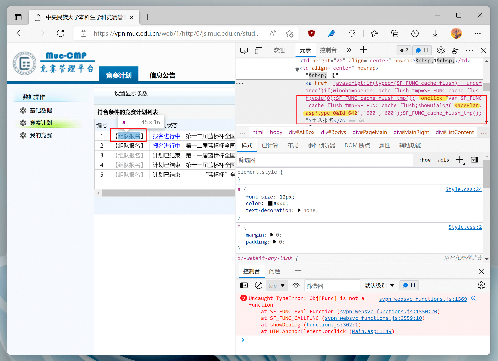

截至该文章的写作时间 (2022 年 3 月 20 日)，[MUC 的竞赛管理平台][jingsai] (校外访问需经由 [MUC 远程接入 VPN 系统][muc-vpn]) 已经相当老旧，苟延残喘，在现代浏览器上几乎无法使用。

> 不建议在个人工作使用的电脑上安装 Sangfor (深信服) 的客户端程序，尽量通过 Web 页面远程接入。

因作者权限问题，本篇文章仅能站在学生用户的角度分享一下使用体验和使用经验。

在现代浏览器 (如 Chrome, Microsoft Edge) 上，用户尚能进入页面，并进行简单的数据查询，但是由于弃用的 API，许多超链接已经无法点击，更不用说还在使用 Flash 作为上传控件的证书上传页面。

## 组队报名

若学生要将自己参加竞赛的信息录入系统，则需要教师事先在系统中创建对应的计划。

之后，学生可以在“报名开始”至“报名结束”的时间内 (即“报名阶段”) 申请报名。

如图，在基于 Chromium 内核的新版 Microsoft Edge 浏览器中，点击计划前的按钮 <kbd>【组队报名】</kbd> 并没有反应；打开调试界面之后，可以看到控制台中输出了错误信息。

<figure>

<figcaption>检查“组队报名”按钮</figcaption>
</figure>

> 用户可以通过右键点击页面上的元素，展开上下文菜单，选择“检查”或者“检查元素”，即可打开如图所示的界面。

不过，通过观察该 `<a>` 元素的 `onClick` 属性，可以观察到，编写者原本的意思是希望在某种“对话框”中打开一个相对链接 (见图右侧红框中高亮部分)。

由于文章写作时期，学生尚未返校，因此需要通过 VPN 访问竞赛管理平台。观察到报错信息中调用了 `SF_` 前缀的方法，猜测是由于使用了 Sangfor (深信服) 的解决方案而导致的 Bug。有条件的读者，可以尝试在校内访问竞赛管理平台。

不过，经尝试发现，该问题可以通过 Microsoft Edge 的 **Internet Explorer 兼容模式** 解决。

可以参考 [How to enable IE Mode on Microsoft Edge Chromium - Pureinfotech](https://pureinfotech.com/enable-ie-mode-microsoft-edge-chromium/) 的内容打开 Microsoft Edge 的 Internet Explorer 兼容模式。之后，在 IE 兼容模式下访问或重新加载 [MUC 远程接入 VPN 系统][muc-vpn]，并转到竞赛管理平台进行访问。

在该模式下，笔者顺利完成了竞赛计划的报名环节。

[jingsai]: http://js.muc.edu.cn
[muc-vpn]: https://vpn.muc.edu.cn

## 证书上传

报名完成后，需要教师通过学生的申请，之后便进入“报名通过”状态。这时，学生便可以在“我的竞赛”页面查看自己参与的竞赛，并上传比赛获得的证书。

同上一节的原因，用户在经由 Web VPN 访问时，普通模式下点击竞赛条目后的 <kbd>【上传证书】</kbd> 等按钮并无反应。

<figure>

<figcaption>检查“上传证书”按钮</figcaption>
</figure>

需要注意，接下来的方法，读者应使用现代浏览器正常访问网页，并非在 IE 兼容模式下访问。

使用上一节中的方式对该元素进行调试，可以获得该链接尝试访问的相对路径地址。在本例中为 `../upload/upimage.asp?Id=16921` (见图像红框中高亮部分) —— 注意链接中的 `..` 表示上一级路径。

观察当前浏览器地址栏中的地址，末尾的结构应类似如下：

    ...js.muc.edu.cn/student/Main.asp

则接下来应该访问的网页地址应修改为： 

    ...js.muc.edu.cn/upload/upimage.asp?Id=16921

访问对应链接后，可以发现页面中间显示“不支持此插件”。

<figure>

<figcaption>检查证书上传页面的元素</figcaption>
</figure>

通过检查页面元素可以发现，这是一个 Flash 插件，该技术已经过时，并且无法再在现代浏览器中使用。

笔者向友人 [@Coelacanthus](https://matrix.to/#/@coelacanthus:mozilla.org) 询问使用 Flash 控件的方法，友人告诉笔者成功使用 Flash 的可能性极低，并建议笔者分析文件上传的请求，从而绕过控件完成文件上传。

<figure>

<figcaption>友人的指点</figcaption>
</figure>

然而笔者既不了解该竞赛平台所使用的技术 —— ASP，也不了解 Flash 控件，只好从网页的 HTML 源代码开始分析。

> 右键页面打开上下文菜单，点击“查看源”或“查看页面源代码”即可。

打开页面源代码后，发现除了组成页面的元素之外，即是一篇很长的 JavaScript 脚本。阅读脚本，其中第一个声明的 `challs_flash_update` 方法便因其奇怪的命名方式引人注目——该方法以一个无明显意义的 `challs` 单词作为方法名的前缀。

于是 [使用搜索引擎 (Bing) 查找关键字 "challs_flash_update"](https://www.bing.com/search?q=challs_flash_update)，搜索可得 [一篇博文](https://www.cnblogs.com/New-world/archive/2012/11/06/2756982.html)，根据该博文中的内容可知该控件名为 CFUpdate，以及该控件制作方为 [CHALLS 工作室](http://www.access2008.cn/)。

> 如果使用某种方式尝试成功播放页面上引用的 Flash 控件 (SWF 文件)，也可以发现关于该工作室的信息。

在该工作室的页面上，可以看到该控件已经更新为“[HTML5 批量上传组件](https://www.access2008.cn/html5update/)”。

根据页面上的介绍，使用该控件大概分为下面几步：

1. 在 HTML 页面上留置一个拥有 ID 的 `
` 标签，以便之后可以通过 DOM 注入界面；
1. 引入 CFUpdate 的 JavaScript 包 —— `CFUdate.min.js`；
1. 定义一个 `challs_flash_update` 的初始化函数（负责定义一些配置，主要是上传文件的路径），这个函数会返回一个对象，存储着相应的配置信息；
1. 同上，定义一些样式配置；
1. 新建一个 JavaScript `CFUpdate` 对象，通过若干次方法调用对其进行初始化，包括参数的传入、以及方法的绑定（完成某些事件后网页需要进行的动作，比如弹窗）；
1. 调用该对象的 `start` 方法，将内容注入 HTML 页面；
1. 之后便可以使用该控件完成上传操作。

从函数的命名可以看出，虽然技术已经摆脱了 Flash，但命名尚未更改，因此猜测接口并未发生大部分修改，即制作方使用新的技术替代了原有的 Flash 控件，并保留了一定的兼容性。也就是说，存在可以直接替换掉 Flash 插件、使用更新后的程序完成同样功能的可能。

同样，由于上述控件的使用步骤均是由 JavaScript 完成，因此可以通过在网页调试工具的控制台中执行相应的语句，来在本地浏览器层面完成上传界面控件的载入或替换。

> 事实上，只需要修改几行代码，就可以完成该页面的升级，然而竞赛管理平台的管理员似乎并没有进行更新。

于是，我们首先 [下载 CFUpdate](https://www.access2008.cn/html5update/HTML5_CFUpdate0.9.2.zip) 到本地计算机，解压后，使用文本编辑器 (如 [Visual Studio Code](https://code.visualstudio.com/)) 打开该目录，可以看到 `updateForASP` 等目录。

进入 `updateForASP` 目录：可以看到：

- `CFUpdate.min.js` 文件，这就是上文所说的 CFUpdate 的 JavaScript 包；
- `Config.js` 文件，其中存储有上述步骤所提及的配置信息；
- 若干 `.html` 文件中则包含关于如何调用并初始化该控件的 JavaScript 语句，以及一部分和完成某些事件后网页需要进行的动作相关的语句。

这时，再次观察竞赛平台证书上传页的 HTML 源代码，发现其中主要包含一部分和 `Config.js` 中类似的配置相关内容，以及一些网页的动作相关的回调函数。这其中最主要的就是 `challs_flash_update` 函数中关于接收文件上传的服务器的地址。

通过比较竞赛管理平台网页源代码文件的内容和开发者提供的 `Config.js`，发现除了标题和接收文件的服务器地址不同外，二者几乎相同。

<figure>

<figcaption>查看竞赛管理平台证书上传页面的源代码并获得上传图片的网址</figcaption>
</figure>

服务器地址在 `challs_flash_update` 函数内，通过类似 `a.url = "update.asp?Id=16921";` 的语句表明。读者可以根据自己页面中的语句，修改 `Config.js` 中的内容。

> 除此之外，竞赛管理平台网页源代码中内嵌的 JavaScript 脚本中并未观察到原有的注释，也没有观察到代码来源。

<figure>

<figcaption>修改 <code>Config.js</code> 中的内容</figcaption>
</figure>

因此，替换控件的步骤为：

1. **查看证书上传页面的源代码**，找到对应的语句，**修改** `Config.js` 中的内容；
1. 打开网页的**开发者工具**：
1. **引入 CFUpdate 的包**——在控制台中，将 `CFUpdate.min.js` 文件中的全部内容粘贴进入并提交；
1. **覆写若干提供配置文件的函数**——在控制台中，将修改过的 `Config.js` 文件中的内容全部粘贴进入并提交；
1. **参照示例 HTML 中的代码，完成对象创建、函数绑定等操作**——打开 `1.html`，将其中从新建 `CFUpdate` 对象的语句 (48 行)，到 `setPostObj` 方法 **之前** 的语句 (115 行) 复制粘贴到控制台中并提交（示例 HTML 中脚本的剩余部分为其余的配置项，这些部分的等价物已经包含在的竞赛管理平台网页的源代码中，并已经被执行）
1. **将控件注入当前页面**——执行对象的 `start` 方法 (127 行)，需要注意其中 `getElementByID` 方法的参数。由于该页面中现有的元素只有一个 `
` 具有 `id` 属性，为了简便，我们直接将控件注入到这里，即，将执行的语句修改为 `c.start(document.getElementById("show"),580,508);` （由于该 `
` 对象已经设定了 `onDblClick` 属性，即绑定了双击事件——清空内容，因此在接下来的使用中需要注意不要不小心双击页面；此外，该步代码执行时可能会提示错误，无需理会）

<figure>

<figcaption>执行完成后的效果图</figcaption>
</figure>

之后可以发现页面下部出现了上传文件的控件界面，正常使用一般即可完成上传操作（选择文件后，需要点击上传按钮）。上传完成后，关闭页面即可。

## 查看证书

可以在“我的竞赛”页面查看参与的比赛已经已上传的证书。如果链接无法打开，参照前文提及的方法。
